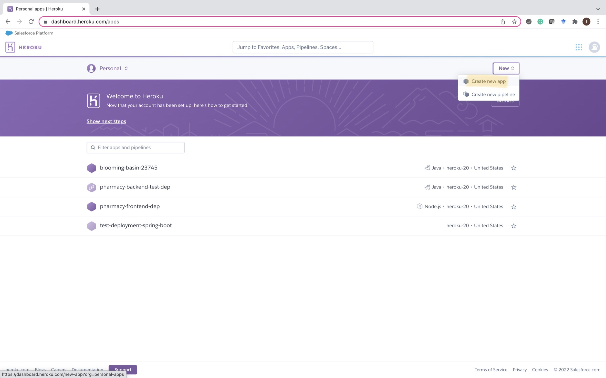
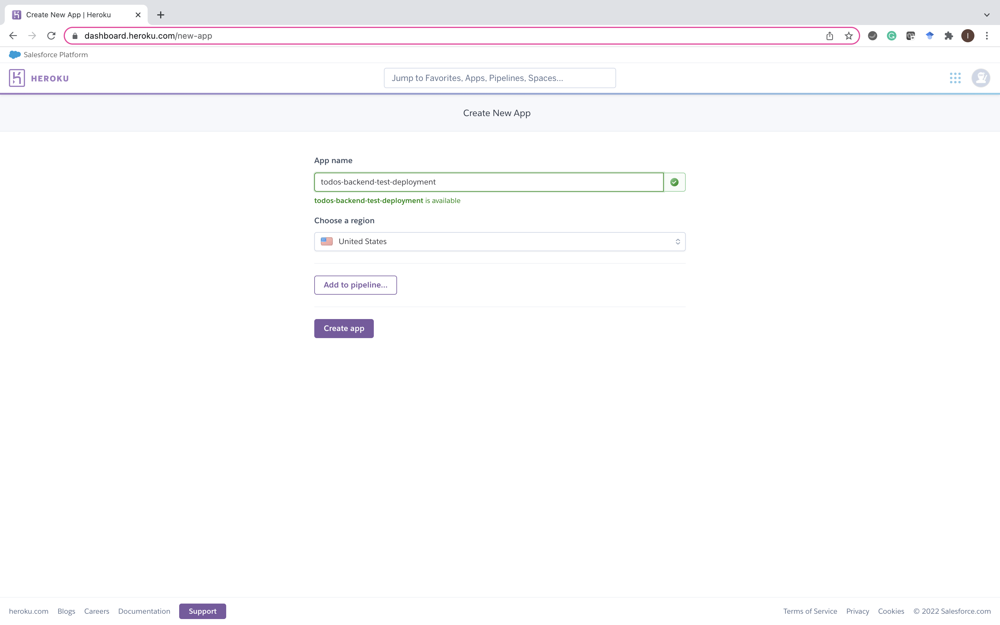
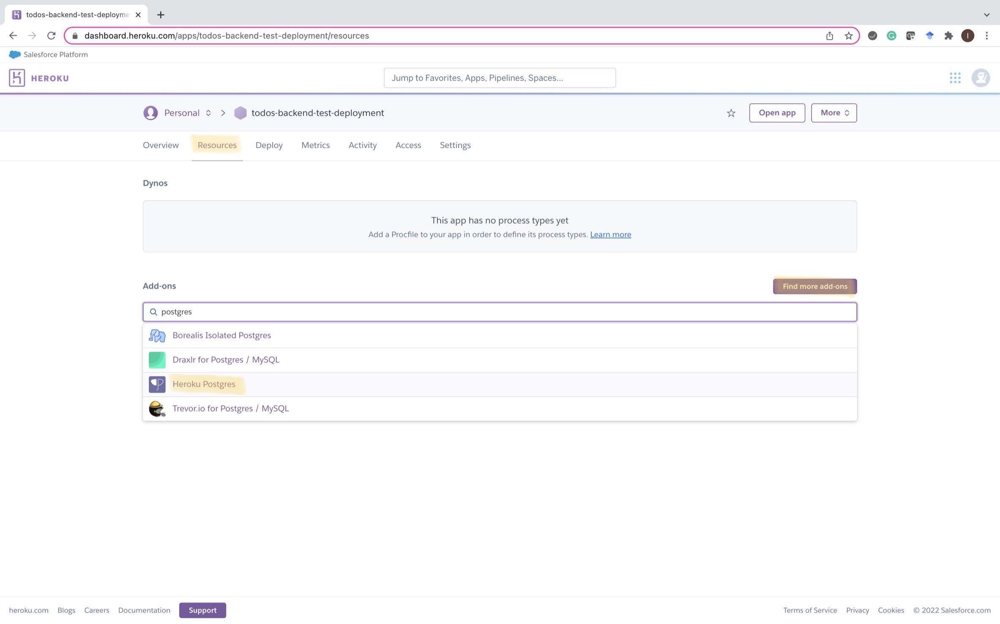
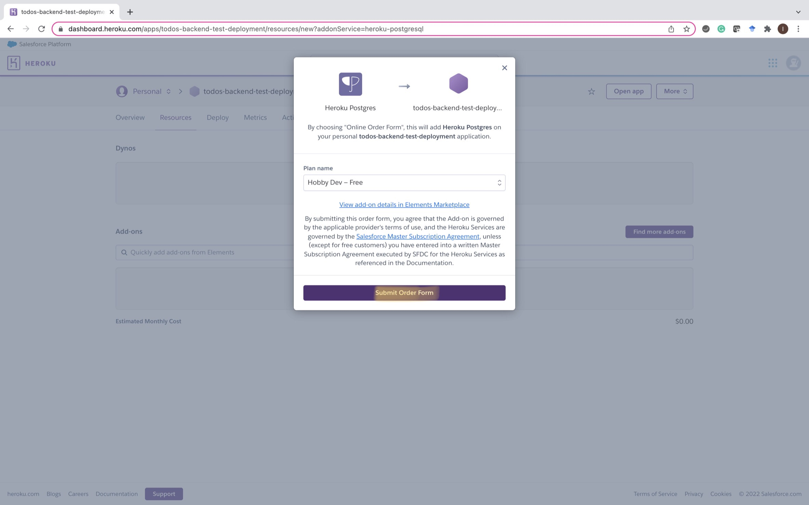
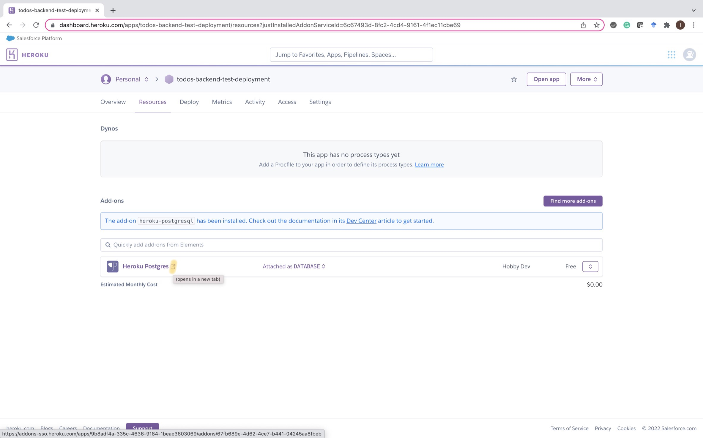
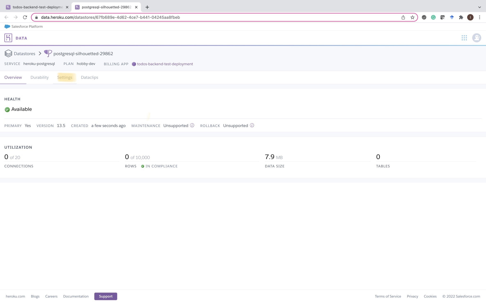
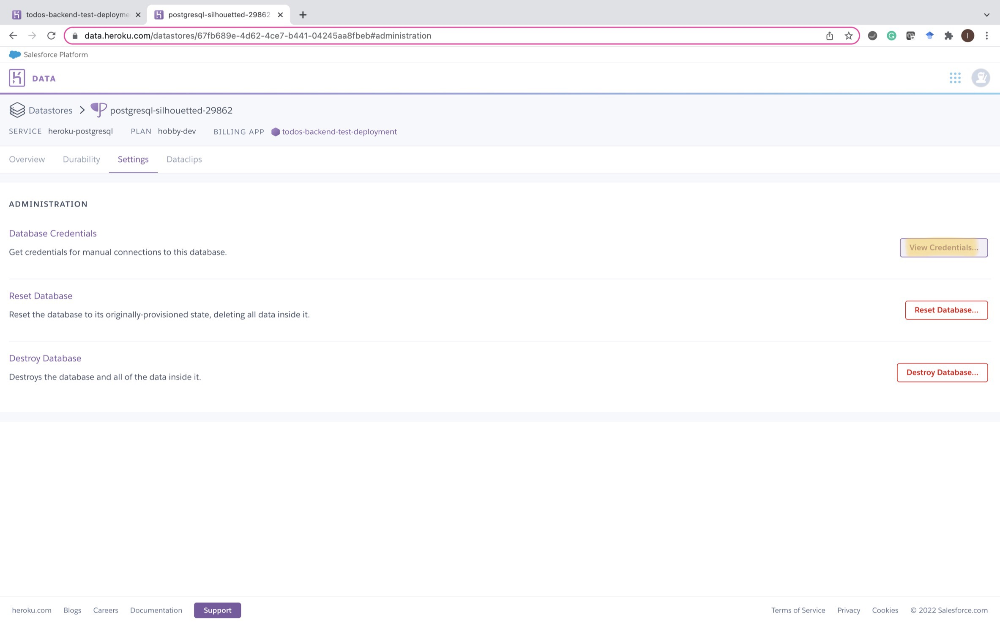
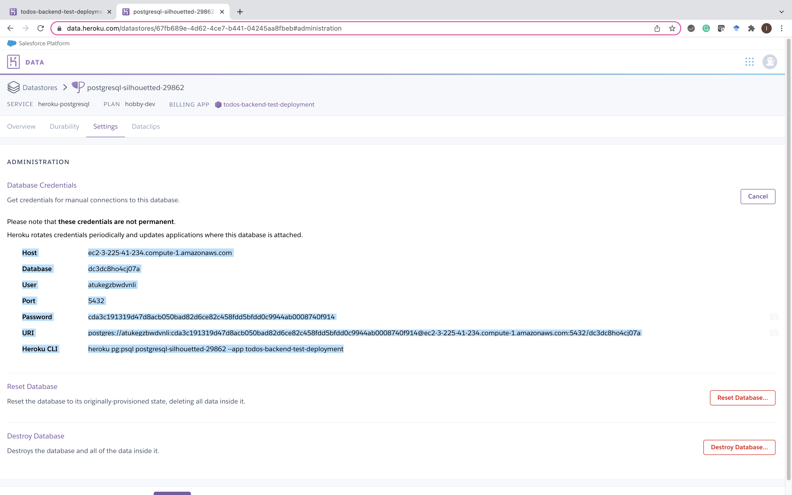
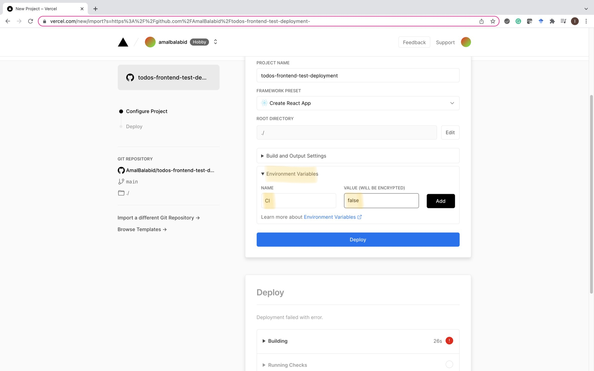

# Deploying a Spring Boot project 

The following shows how to deploy a Spring Boot project with React using PostgreSQL database
* The backend will be deployed on Heroku using PostgreSQL database
* The frontend will be deployed on Vercel

## Backend deployment
### Heroku account
* Create a Heroku account [Heroku’s SignUp Page](https://signup.heroku.com/)
* Login using your email and password

### Set up heroku app
* from the home page create new app 


* Insert app name (must be unique)


* Select resource then find more add-ons to add Heroku postgres



* Open database credentials as shown bellow





We will use these credentials to configure our app

### Set up your project before deployment

* Modify your application proprieties file by adding the new database credentials 

```
spring.datasource.url=jdbc:postgresql://<Host>/<Database>
#change username
spring.datasource.username=<User>
#change password
spring.datasource.password=<Password>
spring.jpa.show-sql=false
spring.jpa.hibernate.ddl-auto=update
#change this line
spring.jpa.properties.hibernate.dialect=org.hibernate.dialect.PostgreSQLDialect
#spring.jpa.properties.hibernate.dialect = org.hibernate.dialect.MySQL5Dialect
spring.jpa.properties.hibernate.format_sql=true
server.port=${PORT:8080}
```

* Update your pom.xml file 

  * Remove mysql dependency and add postgresql dependency
```
  	<dependency>
		<groupId>org.postgresql</groupId>
		<artifactId>postgresql</artifactId>
		<scope>runtime</scope>
	</dependency>
```

  * Add this plugin
```
    	<plugin>
		<groupId>org.apache.maven.plugins</groupId>
		<artifactId>maven-compiler-plugin</artifactId>
		<version>3.1</version>
		<configuration>
			<source>1.8</source>
			<target>1.8</target>
		</configuration>
	</plugin>
```

* Make sure to target the correct Java runtime environment.

### Push your project to github and connect heroku with your project repo 
* connect heroku to your repo

* deploy the main branch

## Frontend deployment
### Deploy frontend on Vercel

* Before push your work to github change all requests from <http://localhost:8080/> to <https://herokuAppName.herokuapp.com/>

* Push frontend to a new repo 

### Vercel account
* Create a vercel account [Vercel’s Signup Page](https://vercel.com/signup)
* Login using your email and password

### Connect vercel with your frontend repo 

* Connect vercel to your frontend repo then, in the project configuration add a new environment variable with this value
```
CI = false 
```


* Deploy the project 

Here we are done! You can now view your project and test all requests. 
